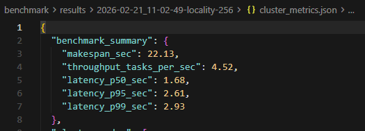
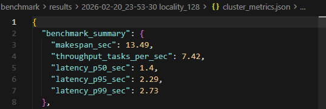

## 2.16 - 2.22 report
1. benchmark实验
    - 集群状态：1 head节点（cpu=0），4 worker 节点（cpu=2）
    - 在一个node上初始化一个tensor（大小为64MB~256MB），设置100个任务，每25个为一个batch（范围从100 ~ 400，为了模拟不同workload的任务）
    - 部分结果  
      
    
    - 随着tensor大小的增大，throughtput降低，任务平均执行时间变长

2. Worker node 高速通道queue研究
- 目前，Ray在2026的版本支持了两种相关的类似调度
    1. 基于Kueue的抢占式优先级调度
    2. 基于Kueue的Gang调度（批量
    - Kueue是一个k8s相关的插件，上面的这两种做法都是在任务进入集群前进行的优先级调度或者排序
    - Kueue的抢占机制：假设目前ray集群基于k8s部署。假设有两个RayJob（ray定义的一种任务），Job A（4GPU），Job B（2GPU），A首先进入队列，然后进入集群执行（对应Ray拉起节点，将Job分配到某些worker节点执行）。当B到来（假设优先级比A高，那么Kueue可以直接和KubeRay交互（ray和k8s进行交互的一个组件，可以控制ray集群），强制停止当前正在执行A的相关节点。于是资源就被空出来了，Ray只能记录到A失败，随后B进入，开始执行
    - 特点：与ray底层任务调度无关
- 高速通道idea
    - 一些背景：
        - 小对象（<=100kb）：存储在worker线程的in-process store中。大对象 (>100KB)一定存储在node的object store中
        - 小对象的拷贝：1. 检查in-process store 2. 如果没有，直接向owner进程发送gRPC请求（GetObject RPC，进行进程间通信，不经过Raylet）3. owner进程收到请求后，从in-process store中取出值，通过gRPC回包发送 4. 拿到值，继续执行
        - 大对象的拷贝：1. 检查本地object store 2. 如果没有，向raylet请求获取 3. raylet像大对象的owner发送请求 4. owner收到后，从自己的object store获取，通过gRPC流式传输回 5. 收到后写入自身的object store，worker线程通过共享内存访问的方式进行读取
    - 场景：
        - Node A目前运行了3个不同的任务，这3个任务分别是ABC，重要程度是C>B>A，在差不多的时间，这三个任务都各自call了大对象，然而这三个大对象都在另一个Node上。假设A首先call大对象，其次到B到C。那么传输顺序是否会是B会等待A传输完再到B，最后到C？
        - 实际上，这涉及到Node之间的Raylet传输，在Ray中，不会排队等待A传输完再开始B，它们是并发进行的（raylet启动3个stream独立的进行传输，gRPC多路复用）但会受到Object Manager的网络资源管理
        - 瓶颈点
            1. A首先发起请求，那么A的连接会首先建立，会占用一部分带宽。高优先级任务C的对象传输会因为A和B而变慢（如果Node A到Node B的带宽是10Gbps，三个任务同时传，每个任务大约只能分到3.3Gbps）
            2. Object Manager内部有一个最大并发拉取任务的阈值。如果请求太多，后续的请求会进入队列
        - 相关代码：src/ray/object_manager/object_manager.cc
        - 困难点（目前疑惑的）
            - 在底层cpp文件，objectmanager并不知道对应是哪个任务（不知道任务细节），因此如果需要在底层建立这样的一个queue，需要一路从python任务定义的时候把优先级透传到底层代码部分
            - 在业务层（应用层）实现会更加简单，比如设置一个TaskActor，每个需要传输大对象的请求都进入这个Actor统一进行处理。但是这种就是工程化的实现了
        - 目前方案
            - 在ray源码中，对象传输会把大对象切分成chunk进行流式传输。底层有一个PushManager负责管理所有对外发送Push的数据请求。底层使用round-robin，对于多个请求（此时每个请求负责传输的对象已经被切分为chunk，放入了一个队列中）循环遍历每次从头拿出一个然后传输
            - 目前在底层PushManager只能拿到需要传输的对象ID和大小，除此之外拿不到任务的细节。因此需要在这里新增一个priority字段（假设需要从python任务定义层一路透传）
            - 源码：src/object_manager/push_manager.cc/void PushManager::ScheduleRemainingPushes()
            - 可以参考的依据：1. 对象大小，小对象先传，大对象后传 2. 用户自定义

3. workload-aware

